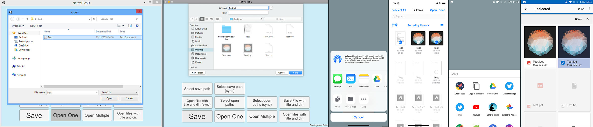

# NativeFileSO

**NativeFileSO** adds native file import and export functionality across Windows, macOS, iOS and Android to your Unity project.



### Features
* Select external files and load their byte contents.
* Export / Share files to a user-selected path / app.
* Associate file types with your app (mobile only).
* Select save and open paths (desktop only).

With all of the functionality that NativeFileSO can offer, there are still some limitations due to platform specific constraints, so please make sure to carefully read the section on [requirements & limitations](#requirements-&-limitations).

## Support this project

NativeFileSO is available for free. [Donations](https://keiwan.itch.io/nativefileso/purchase) to support the time and effort that has gone into this project are greatly appreciated!

## Real world example

I wrote this plugin in order to use it in one of my own projects: [Evolution](https://keiwan.itch.io/evolution). It's a cross-platform sandbox game/simulator that demonstrates machine learning with evolutionary algorithms. This plugin allows it to import and export save files both from within the app and also to associate the custom save file types with the mobile apps so that they show up in the list of apps that can open those files.

Evolution is available on all platforms and it's probably the easiest way to get a sense of what this plugin behaves like once it has been integrated into an actual application.

Its source code is available [here](https://github.com/keiwando/evolution).

## Setup

Setting up the asset requires relatively little work. After *importing the package* contents, you should have the following folder hierarchy inside of your `Assets` folder:

```
Assets/
|- ...
|- NativeFileSO/
|  |- Editor/
|  |- Prefabs/
|  |- Samples/
|  |- Scripts/
|- Plugins/
   |- ...
   |- NativeFileSO/
      |- Android/
      |- iOS/
      |- macOS/
      |- Windows/
```

In order for NativeFileSO to be able to function properly, it needs to know about certain system events (such as when the app enters the focused state or when it is launched). That's what the `NativeFileSOUnityEvent` prefab is for.

Simply drag and drop the `NativeFileSOUnityEvent` prefab from the `NativeFileSO/Prefabs/` folder into your scene. This should be the first scene that is loaded when your game starts.


### Setup file associations

If you are not planning to associate any file types with your app, you are done with the setup and you can open and export files through the interface provided by the `NativeFileSO` class as demostrated in the [examples](#examples).

Otherwise, continue with the following steps:

Inside of your own MonoBehaviour class that you want to deal with associated files that the user is trying to open in your app, you need to subscribe to the `FilesWereOpened` event that is raised by the shared instance of the `NativeFileSOMobile` class.

```csharp
using Keiwando.NFSO;

public class MyFileHandler : MonoBehaviour {

    void Start() {
        NativeFileSOMobile.shared.FilesWereOpened += delegate (OpenedFile[] files) {
            // Process the opened files
        };		
    }
}
```

For this behaviour to work reliably, we need to make sure that the `FilesWereOpened` event is never raised before we had a chance to subscribe to it. In the Unity editor, go to 

    Edit > Project Settings > Script Execution Order

and add `Keiwando.NativeFileSO.NativeFileSOUnityEvent` to the list and assign it the value 32000.


You associate file types with your app by including them in the `supportedFileTypes` array in the `SupportedFilePreferences.cs` file. You can use the presets or create your own instances of the `SupportedFileType` class.

```csharp
public static readonly SupportedFileType[] supportedFileTypes = {

    // Edit this list to include your desired file types

    SupportedFileType.JPEG,
    SupportedFileType.PlainText
    //SupportedFileType.Any
};
```

These files will be automatically associated with the iOS app, however, the Android plugin requires one additional step. After editing the `supportedFileTypes` array, wait for the Editor to compile the scripts and then click on the **Tools > NativeFileSO > RefreshAndroidPlugin** menu item. You will need to manually do this once each time you change the list of associated file types.

Also make sure to read the section on general [requirements & limitations](#requirements-&-limitations) and adjust your project and build settings as described for each platform.


## Examples

The `NativeFileSO` class provides the main interface for you to interact with the functionality on all platforms. The `NativeFileSOMacWin` class offers some additional functionality that is only available on desktop platforms, such as the ability to select file paths (without loading the file contents immediately).

All of the classes you need to interact with are contained in the `Keiwando.NFSO` namespace, so the following examples are assumed to contain a

```csharp
using Keiwando.NFSO;
```

statement at the top of the file.

Visit the [documentation](http://keiwando.com/nativefileso/docs/) for a more detailed reference of what each class shown here does.

### Export a file

The following example demonstrates how to use the `NativeFileSO` class in order to copy/export a file from an existing path to a new location chosen by the user.

```csharp
string path = "path/to/existing/fileToSave.txt";
string newFilename = "ExportedFile.txt";

FileToSave file = new FileToSave(path, newFilename, SupportedFileType.PlainText);

// Allows the user to choose a save location and saves the 
// file to that location
NativeFileSO.shared.SaveFile(file);
```

### Open a single file

This snippet shows how to use the `NativeFileSO` class in order to let the user choose a text file and handle its loaded contents.

```csharp
// We want the user to select a plain text file.
SupportedFileType[] supportedFileTypes = {
    SupportedFileType.PlainText
};

NativeFileSO.shared.OpenFile(supportedFileTypes,
  delegate (bool fileWasOpened, OpenedFile file) {
    if (fileWasOpened) {
        // Process the loaded contents of "file"
        Debug.Log(file.ToUTF8String());  
    } else {
        // The file selection was cancelled.	
    }
});
```

## Screenshots

### macOS


### Windows


### iOS


### Android


## Requirements & Limitations <!-- anchor: requirements-&-limitations -->

Here are the main limitations and platform requirements for the asset that you should read and take into consideration before deciding on whether you would like to integrate NativeFileSO into your own project.

#### Windows
* The Windows build requires at least the **.NET 2.0** (not subset!) API compatibility level and the **Mono** scripting backend (IL2CPP is not supported on Windows)

#### macOS
* The Open and Save panels don't show custom titles on OSX 10.11 and above.

#### Android
* Supports **Android 4.4**
* Requires the Gradle build system! Doesn't work with the internal build system.
* Does not support minification! (Set PlayerSettings > Publishing Settings > Minify > None)
* The Android File Browser doesn't guarantee which file type is selected by the user (Can't filter by extension and MIME types are unreliable too)
* File extensions cannot be reliably associated with the application on Android, so only the MIME type is used for the association. This is mainly important if your app supports a custom file type. In this case, you can set its MIME type to `"application/octet-stream"` or more generally associate every file type with your app (using a wildcard MIME type of `"*/*"`) and deal with invalid file types from within the app after the files have been loaded.
* When the user opens a file with an associated type with your application, the app is restarted.

#### iOS
* Supports **iOS 11+**
* Using “Copy to” with a `UIActivityViewController` only copies the first file of the selection to your app - this is an iOS limitation. Multiple files can be imported at once from within the app using the `OpenFiles` function.

#### Mobile (iOS + Android)
* The file associations only work for files that exist locally on the device. (The files are not downloaded and imported from an online URL.)
